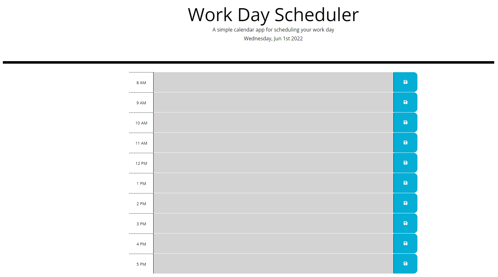

# APIWorkDaySchedulerHW5
I was given code that had a preset skeleton to it, but I had to do the javascript and fill in the timeblocks for the code.
I also installed the moment.js library so I can keep the times updated along with making sure that the planner was able to save the data locally.
It also dynamically updates the css and html according to the current time.

USER STORY:
AS AN employee with a busy schedule
I WANT to add important events to a daily planner
SO THAT I can manage my time effectively

ACCEPTANCE CRITERIA:
GIVEN I am using a daily planner to create a schedule
WHEN I open the planner
THEN the current day is displayed at the top of the calendar
WHEN I scroll down
THEN I am presented with timeblocks for standard business hours
WHEN I view the timeblocks for that day
THEN each timeblock is color coded to indicate whether it is in the past, present, or future
WHEN I click into a timeblock
THEN I can enter an event
WHEN I click the save button for that timeblock
THEN the text for that event is saved in local storage
WHEN I refresh the page
THEN the saved events persist

